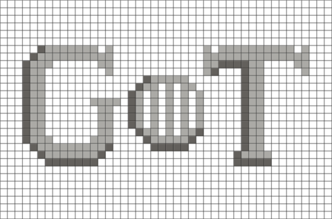

      

   José Luiz Dantas

# Quem sou eu 

Aluno de programação Jogos Digitais (IFRN - Ceará-Mirim), 3º ano vespertino. Músico e gamer nas horas vagas.

# Portfólio

## Games
* * *
### 2017
1.**Pyramid Escape**
[1º Bimestre](https://jldifrn.github.io/PyramidEscape)   
2._Servidor de mensagens_
[2º Bimestre](https://jldifrn.github.io/ServidorDeMensagens)   
   
3.**Ardenas Retake**
[3º Bimestre](https://jldifrn.github.io/ArdenasRetake)    
4._Bacteria_
[4º Bimestre](https://eriksonnicacio.github.io/bacteria2/)

[TEXTO QUE VAI APARECER](link)
* * *
## Artes

* Em breve

* * *
## Projetos
* Em breve
* * *
## Sons
* Em breve
* * *

## Referencias
* Em breve

* * *

** negrito  
_ italico  
~~ riscado  
3* linha horizontal (barra)
#s uma ou mais hashtags criam capitulos ou sub
*s asteriscos criam lista não ordenada
1s numeros criam lista ordenada
* * *

