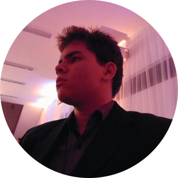

                          
   **José Luiz Dantas**

# Quem sou eu 

Aluno de programação Jogos Digitais (IFRN - Ceará-Mirim), 3º ano vespertino. Músico e gamer nas horas vagas.

# Portfólio

## Games

### 2017
* * *

## 1.**Pyramid Escape**
   
   
#### Desenvolvimento: 1º Bimestre - Tema: Cultura  
#### Escape da pirâmide se não quiser ficar preso ao deus Seth para sempre.  
#### Autores: José Luiz e Erikson

* * *

## 2.**Servidor de mensagens**
   

#### Desenvolvimento: 2º Bimestre - Tema: Mensagem
#### Entregue as encomendas e mantenha seu emprego.  
#### Autores: José Luiz e Elielton

* * *

## 3.**Ardenas Retake**
   

#### Desenvolvimento: 3º Bimestre - Tema: Livre
#### Seja um bravo soldado e reconquiste o campo de batalha.
#### Autores: José Luiz, Erikson e Victor Rodrigues

* * *

## 4.**Bacteria**
   

#### Desenvolvimento: 3º Bimestre - Projeto Integrador
#### Ajude a expulsar bacterias e vírus de vasos sanguíneos infectados.
#### Autores: José Luiz, Erikson e Victor Rodrigues

* * *
## Artes

* Em breve

* * *
## Projetos
* Em breve
* * *
## Sons
* Em breve
* * *

## Referencias
* Em breve

* * *

** negrito  
_ italico  
~~ riscado  
3* linha horizontal (barra)
#s uma ou mais hashtags criam capitulos ou sub
*s asteriscos criam lista não ordenada
1s numeros criam lista ordenada
* * *

